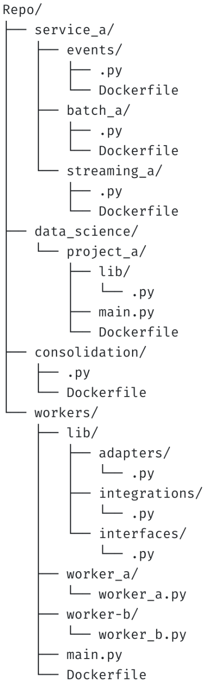

# QUESTION 1
## Repo Structure & Dependencies
Having the following repo structure

We would like to make the workers/lib available to all the repo, how would you do so? Avoid dependency hell.

# ANSWER
The answer for this question is simple you can change the folder structure form the workers and transform it into a package in this case the new structure is something like this:

    repo/
    ├── data_science/
    │   └── project_a/
    │       └── lib/
    │           ├── Dockerfile
    │           └── main.py
    └── local_packages/
        ├── setup.py
        └── common/
            ├── __init__.py
            ├── libs/
            │   ├── __init__.py
            │   ├── adapters/
            │   │   └── __init__.py
            │   ├── integrations/
            │   └── interfaces/
            ├── worker_a.py
            └── worker_b.py

To run a test you can:

1. Go into the repo folder:

        cd repo/

2. Install the packages

        sudo pip3 install local_packages/

3. After the installation is complete you can go into the Project a of Data Science

        cd data_science/project_a

4. Run the python code

        python3 main.py

# EXTRA

