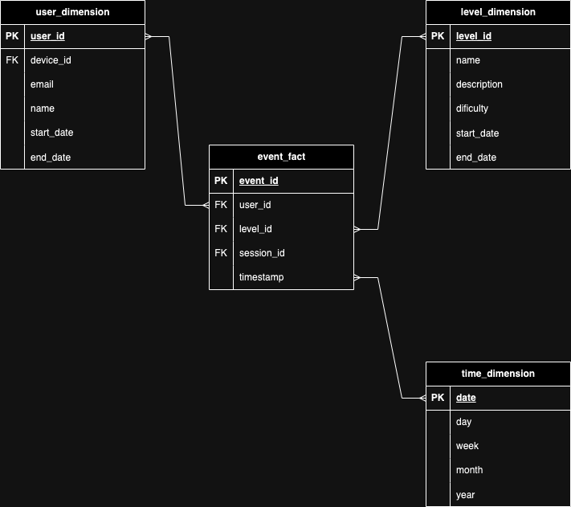
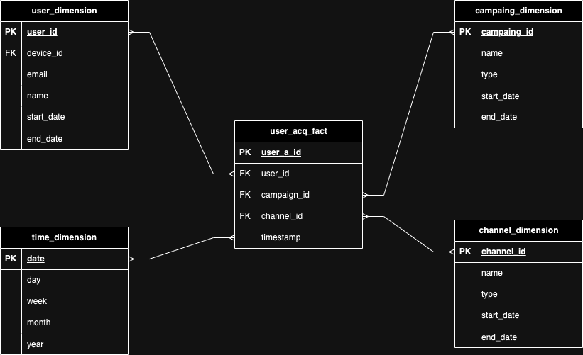
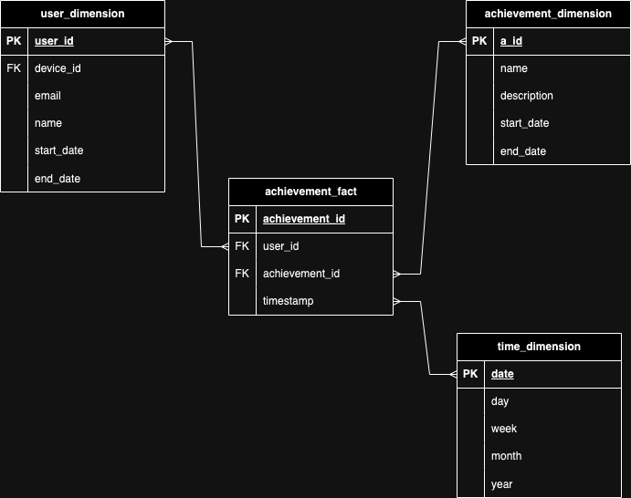
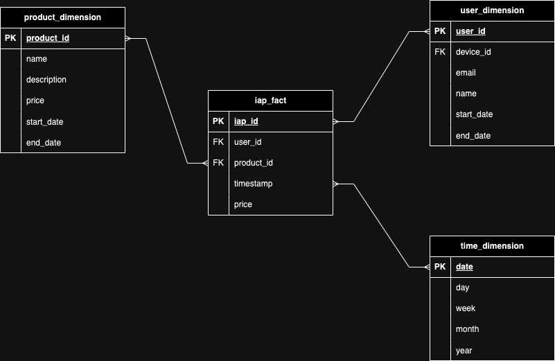

# Question 3
## Data Modeling
You are tasked with designing a data model for our games, incorporating `levels`, `achievements`, and `in-app purchases` (IAP). Our data warehouse is BigQuery, our `event schema follows GA4`, and we utilize Apps Flyer as our `User Acquisition (UA)` system. In addition to outlining the data transformation steps, creating an Entity-Relationship Diagram (ERD), and establishing relationships between entities, please elaborate on how you would link the UA data with the events. Please explain how you would address late-arriving and SKAN UA data. The ultimate objective is to empower our primary stakeholders (product and marketing) to independently analyze the data (self-serving analytics)

## Answer
Using the Kimball Methodology for designing a Data Warehouse (DWH) infrastructure involves dimensional modeling, which focuses on organizing data into dimension and fact tables. Let's adapt this methodology to playvalve scenario:

### PART 1: Star Schema Model:

1.  **Dimension Tables:**
    - **User Dimension:** Contains attributes related to users such as:
        - User ID
        - Device ID
        - Demographic information
    - **Level Dimension:** Includes details about each level in the game, such as: 
        - Level ID
        - Level name
        - Difficulty
    - **Achievement Dimension:** Holds information about different achievements, including: 
        - Achievement ID
        - Name
        - Description
    - **Product Dimension:** Stores details about in-app purchases, like: 
        - Product ID
        - Product name
        - Price
    - **Channel Dimension**: Contains attributes related to marketing or advertising channels, such as: 
        - Channel ID
        - Channel name
        - Channel type
    - **Campaign Dimension**: Includes attributes related to marketing campaigns, such as: 
        - Campaign ID
        - Campaign name
        - Campaign type
    - **Time Dimension:** Represents timestamps and various time-related attributes for analysis by time periods (day, week, month, etc.).
2.  **Fact Tables:**
    - **Game Events Fact:** Records user interactions within the game, following the GA4 event schema. It includes foreign keys to link to dimension tables, such as:
        - User ID
        - Level ID
        - Session ID
        - Timestamp
    - **User Acquisition Fact:** Stores data related to user acquisition activities, including metrics from Apps Flyer. It includes foreign keys to link to dimension tables, such as:
        - User ID
        - Campaing ID
        - Channel ID
        - Timestamp
    - **Achievement Fact**: Registers achievement attained by users. It includes foreign keys to link to dimension tables, such as:
        - User ID
        - Achivement ID
        - Timestamp
    - **In-App Purchases Fact**: Captures data related to in-app purchases made by users. It includes foreign keys to link to dimension tables, such as:
        - User ID
        - Product ID
        - Timestamp
        - Transaction ID:

>**__NOTE:__** The Achievement Dimension stores all possible achievements in the game, while the Achievement Fact records when users successfully complete these achievements. This setup enables efficient tracking of user accomplishments and facilitates analysis of gameplay progression and engagement.

### PART 2 Star Schema Representation:

1. **Game Events Fact:**

2. **User Acquisition Fact:**

3. **User Acquisition Fact:**

4. **In-App Purchases Fact**:

### PART 3 UA Data with the Events
To link UA data with events:
- Utilize common keys like User ID shared between User Acquisition Fact and Game Events Fact tables.
- Match Timestamps to associate UA activities with corresponding events.
- Optionally, use Session IDs for finer granularity within sessions.

Practically:
- Join tables based on User ID.
- Filter events by timestamps.
- Analyze UA metrics alongside event data to understand their impact on user engagement.

>**__NOTE__** Another simple option is to do the joins before creating the fact tables because joining 2 fact tables could potentially have a slow performance

### PART 6 Late-arriving, SKAN UA data and Other Problems
- Late-Arriving Data:
    - Queue incoming data temporarily.
    - Adjust timestamps if possible.
    - Process data in batches within defined processing windows to integrate late arrivals.
- SKAN Data:
    - Aggregate conversion values over intervals.
    - Develop attribution models considering SKAN limitations.
    - Enrich SKAN data with additional context.
- Data Quality:
    - Monitor for anomalies and validate data regularly.

### PART 5 Kimbal Dimension Bus Matrix by Department
This is a bus matrix for the potential departments that could use this dimensions. If you want to learn more why the Bus Matrix is required and the [benefits](https://www.dimodelo.com/blog/2023/what-is-a-data-warehouse-bus-matrix-and-why-you-need-one/)

| Dimension              | Achievement | Channel | Campaign | Level | Product | Time | User |
|------------------------|-------------|---------|----------|-------|---------|------|------|
| Product Team           | X           |         | X        | X     | X       | X    |      |
| Marketing Team         |             | X       | X        |       |         | X    |      |
| Analytics Team         | X           |         |          | X     | X       | X    | X    |
| User Acquisition Team  |             | X       | X        |       |         | X    |      |

### Conclusion
In conclusion, to empower product and marketing teams for self-serving analytics, a structured data model has been established, including dimension tables like User, Level, Achievement, Product, Channel, Campaign, and Time, alongside fact tables such as Game Events, User Acquisition, Achievement, and In-App Purchases. To address challenges like late-arriving and SKAN UA data, implementing batch processing within defined windows, aggregating SKAN conversion values over intervals, and enriching data with additional context are proposed solutions. Additionally, the importance of monitoring data quality and adapting schema and architecture for evolving needs is emphasized. These solutions ensure stakeholders can independently analyze data, driving informed decisions and business success.