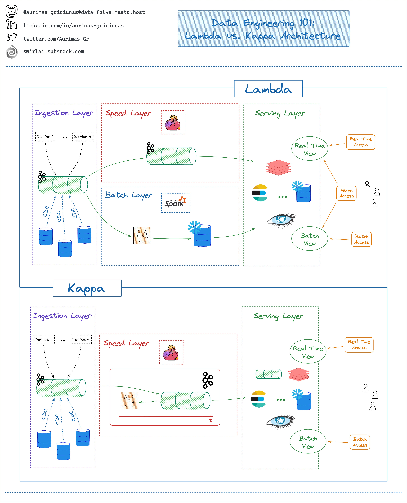
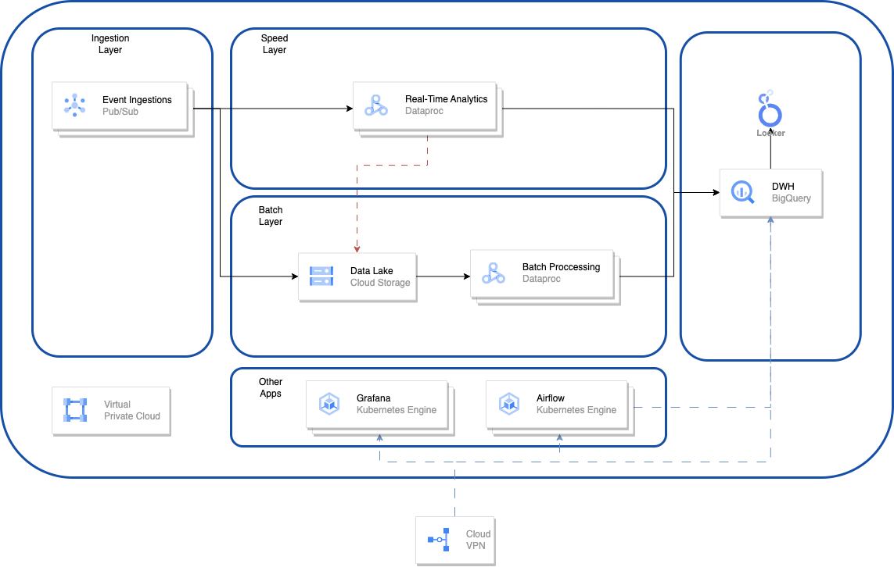

# QUESTION 3
## Cloud Arquitecture
Using GCP as your cloud provider, design an architecture for real-time data streaming and processing. This entails discussing selecting suitable services, managing data ingestion effectively, and ensuring low-latency processing for real-time analytics. The solution needs to be both scalable and cost-effective to meet our requirements.

# ANSWER
## PART 1: DECIDING ARCHITECTURE
Firs it is important to understand the problem, Playvalve is an Gaming company that is going to manage different games and needs, so this system requires to be: 
- real-time Analytics
- Complex transformations (Most likely in a future)
- Scalable
- Cost-efective

## 1.1 Big Data Arquitecture
In the Big Data ecosystem there are two main arquitecture `Lambda` and `Kappa`:
1. **Lambda**: is a hybrid approach that combines batch and stream processing to handle both historical and real-time data. It consists of `3` layers: 
    - **Batch layer**: processes the raw data in batches using a distributed framework like Hadoop or Spark and stores the results in a batch view
    - **Speed layer**: processes the incoming data streams using a low-latency engine like Storm or Flink and stores the results in a speed view.
    - **Serving layer**: queries both views and merges them to provide a unified view of the data. Lambda architecture can handle large-scale, complex, and diverse data sources, but it also introduces complexity, redundancy, and latency in the system.

2. **Kappa**: is a simplified version of lambda architecture that eliminates the batch layer and relies solely on stream processing. It consists of `2` layers:
    - Stream layer: processes the raw data streams using a single framework that can handle both batch and stream processing, such as Spark Streaming or Kafka Streams, and stores the results in a stream view.
    - Serving layer: queries the stream view to provide a unified view of the data.

### 1.2 Lambda v Kappa

### 1.3 Advantages and Disadvantages of Arquitecture
Each of this architectures has their on advantages and disadvantages
- Advantages:
    1. **Lambda**: 
        - Can handle both historical and real-time data
        - Cope with diverse and complex data sources
        - Provide fault-tolerance and scalability
        - Leverage existing batch processing frameworks and tools.
    2. **Kappa**: 
        - Can handle real-time and dynamic data 
        - Simplify the system design and implementation
        - Reduce the resource consumption and operational costs
        - Provide faster and more consistent results
- Disadvantages:
    1. **Lambda**:
        - It can also introduce complexity and redundancy in the system
        - Increase the maintenance and operational costs
        - Cause latency and inconsistency in the results
        - Require more skills and expertise to implement and manage.
    2. **Kappa**:
        - It demand more resources and tuning to ensure reliability and accuracy
        - Challenging to handle batch processing and complex transformations
        - Limited by the stream processing framework and tools
        - Difficult to test and debug.

## TAKE AWAY
In summary, both architectures excel in real-time processing capabilities. However, when scalability is factored in, the Kappa architecture may face challenges with more intricate analytics needs that Playvalve may not currently demand but could anticipate in the future. Thus, while the Lambda architecture may entail higher costs initially, it offers a more resilient framework for the organization's future requirements.

## PART 2: GCP TECHNOLOGIE COMPONENTS
### 2.1 Data Processing
For data processing of big data there are two main stacks that come to mind:
- **Dataflow**: Unified stream and batch data processing that's serverless, fast, and cost-effective. It offers:
    - Real-time insights and activation with data streaming and machine learning
    - Fully managed data processing service
    - Automated provisioning and management of processing resources
    - Horizontal and vertical autoscaling of worker resources to maximize resource utilization
    - OSS community-driven innovation with Apache Beam SDK
- **Dataproc**: Dataproc is a fully managed and highly scalable service for running Apache Hadoop, Apache Spark, Apache Flink, Presto, and 30+ open source tools and frameworks. Use Dataproc for data lake modernization, ETL, and secure data science, at scale, integrated with Google Cloud, at a fraction of the cost.
    - Open: Run open source data analytics at scale, with enterprise grade security
    - Flexible: Use serverless, or manage clusters on Google Compute and Kubernetes 
    - Intelligent: Enable data users through integrations with Vertex AI, BigQuery, and Dataplex
    - Secure: Configure advanced security such as Kerberos, Apache Ranger and Personal Authentication
    - Cost-effective: Realize 54% lower TCO compared to on-prem data lakes with per-second pricing

> **_NOTE:_**  For a more complex discussion check this [link](https://stackoverflow.com/questions/46436794/what-is-the-difference-between-google-cloud-dataflow-and-google-cloud-dataproc).

> **_NOTE:_**  In this discussion people say Dataproc can't handle stream of data but in this [link](https://cloud.google.com/pubsub/lite/docs/write-messages-apache-spark) says otherwise.

As outlined above, both Dataflow and Dataproc possess the capability to handle Big Data processing. The critical factor in determining the choice between them lies in the specific use case. For complex data transformations and analytics, Dataproc offers the advantage of utilizing well-known libraries like Spark ML. However, this entails the additional cost and effort of managing the cluster. On the other hand, Dataflow provides a more straightforward user experience. In conclusion, both technologies excel in handling big data, but Dataproc may offer more flexibility for migration needs in the future.

### 2.2 Data Warehouse
For the DWH it is not going to be dicussed as it is understood from the last question that the current infrastructure already has a Bigquery implemented. But in any case for informative purpose [here](https://cloud.google.com/blog/topics/developers-practitioners/bigtable-vs-bigquery-whats-difference) is a comparison of two technologies for storing data `BigQuery` and `BigTable`. But for academic purpose here are some key benefits of using BigQuery:

1. Scalability: BigQuery is fully managed and serverless, allowing you to scale your data warehouse seamlessly without the need for infrastructure provisioning or management. It can handle petabytes of data with ease.
2. Performance: BigQuery offers high-performance analytics with fast query execution times, powered by Google's infrastructure. It utilizes distributed computing and columnar storage to deliver rapid query responses, even on large datasets.
3. SQL Interface: BigQuery provides a familiar SQL interface for querying and analyzing data, making it easy for users with SQL skills to get started. It supports standard SQL syntax and integrates with popular BI tools and data visualization platforms.
4. Cost-Effectiveness: BigQuery follows a pay-as-you-go pricing model, where you only pay for the queries you run and the storage you use. It offers flexible pricing options, including on-demand and flat-rate pricing plans, allowing you to optimize costs based on your usage patterns.
5. Integration: BigQuery integrates seamlessly with other Google Cloud services, such as Cloud Storage, Dataflow, Dataprep, and Data Studio. It also supports connectors for popular data sources like Google Analytics, Salesforce, and more, enabling easy data ingestion and analysis.
6. Security and Compliance: BigQuery provides robust security features, including encryption at rest and in transit, IAM (Identity and Access Management) controls, audit logging, and data governance capabilities. It is compliant with various industry standards and certifications, such as HIPAA, SOC 2, and GDPR.
7. Machine Learning Integration: BigQuery ML allows you to build and deploy machine learning models directly within BigQuery, using SQL queries. This enables data analysts and data scientists to leverage machine learning capabilities without needing to move data to separate ML platforms.
8. Real-Time Analytics: BigQuery supports real-time data streaming and analysis through integrations with services like Cloud Pub/Sub and Dataflow. This enables you to ingest and analyze streaming data in real-time for immediate insights and decision-making.

### 2.3 Data Ingestion
Data ingestion requires a queue system to manage multiple events, acting as a buffer to prevent system overload. GCP offers an excellent solution for this in the form of Pub/Sub.
- **Pub/Sub**: is an asynchronous and scalable messaging service that decouples services producing messages from services processing those messages. Pub/Sub allows services to communicate asynchronously, with latencies on the order of 100 milliseconds.

> **_NOTE:_** For other types of integration, let's say from an external system that requires the connection to an API might be using our other processing tools

### 2.4 Data Lake
As it is a common practice in today's cloud big data architecture, now a days is handle by simple storage system. In GCP case this storage system is called `Cloud Storage`, some of the benefits of using Cloud Storage are:

1. Scalability: GCS offers virtually limitless scalability, allowing you to store and manage large volumes of data without worrying about capacity constraints.
2. Durability: Data stored in GCS is highly durable, with multiple redundancy mechanisms in place to ensure data integrity and availability.
3. Global Availability: GCS is accessible from anywhere in the world, with data replication across multiple regions to ensure low-latency access for users worldwide.
4. Cost-Effectiveness: GCS offers a pay-as-you-go pricing model, allowing you to pay only for the storage and bandwidth you use. Additionally, storage classes such as Nearline and Coldline offer cost-effective options for storing infrequently accessed data.
5. Security: GCS provides robust security features, including encryption at rest and in transit, IAM (Identity and Access Management) controls, and access controls such as bucket policies and signed URLs.
6. Integration: GCS seamlessly integrates with other Google Cloud services and third-party tools, enabling easy data processing, analysis, and management workflows.
7. Versioning and Lifecycle Management: GCS supports object versioning and lifecycle management policies, allowing you to automate data retention, archiving, and deletion based on predefined rules.
8. Comprehensive API: GCS provides a comprehensive set of APIs and SDKs for easy integration with applications and development frameworks, enabling seamless data access and manipulation.

### Other Tools
- **Orchestration**: can be managed using various resources, and in the case of GCP, Google provides a service called `GCP Composer`. This service is built on [Apache Airflow](https://airflow.apache.org/), an open-source tool designed for orchestrating different batch jobs, all written in Python.
- **Graphana**: Grafana is an open-source analytics and visualization platform for monitoring and observability. It allows users to create interactive dashboards to visualize metrics data from various sources in real-time.
- **DBT**: DBT can also enter into the other tools realm as it can be a good tool to use for BI Analytics and code versioning of the DWH processes

> **_Others_**: There are multiple other tools for other reasons, they maybe missing in here. The point is they can be for example a serve to host jupyter notebooks for data science use or other any use.

### 2.5 Security
All of these services will be hosted in GCP, but a Virtual Private Cloud (VPC) must be implemented to ensure the security triad of Confidentiality, Integrity, and Accessibility, as well as to comply with GDPR and ISO 27001 standards for managing information security. Each service mentioned must be located within the VPC and only accessible through the VPN provided to the team. Additionally, Identity and Access Management (IAM) must be configured and managed by the team to control access to these services.

# CONCLUSION

# Playvalve Architecture Overview

The image above presents a simple Lambda architecture designed to support real-time analytics, complex transformations, and scalability within a Google Cloud Platform environment. While the specific technologies used may vary depending on the requirements of the problems and needs, this serves as a summary of the overall setup.

## Key Components:
- **VPC Security:** All components are contained within a Virtual Private Cloud (VPC) for enhanced security. This ensures that access to sensitive data and services is restricted and controlled.
- **Pub/Sub Ingestion:** Data ingestion is handled by Pub/Sub, a messaging service that decouples senders and receivers of data. It provides reliable, real-time messaging between independent applications.
- **Batch Layer:** Responsible for processing large amounts of data in batches. Utilizes Dataproc, a managed Apache Spark and Hadoop service, for distributed data processing. Spark enables parallel processing and scalable analytics on big data sets.
- **Speed Layer:** Handles real-time data processing to provide immediate insights. It can also store data in the Data Lake if necessary for further analysis. Apache Kafka or Google Cloud Dataflow may be used for real-time stream processing.
- **Serving Layer:** Data is stored in BigQuery Data Warehouse (DWH) for analysis and processing. BigQuery is a fully managed, serverless data warehouse that allows for scalable and fast SQL queries on large datasets. Scheduled tasks, such as data transformation workflows, are managed by Airflow or Composer.

This architecture ensures robustness, scalability, and security for Playvalve's data processing needs, from ingestion to analysis. 

> **_NOTE:_** Achieving cost-effectiveness is possible, but it requires constant monitoring of the data infrastructure. There's no architecture that can guarantee cost-effectiveness if scaling up occurs without assessing the actual need and usage patterns.

# Sources:
- https://www.linkedin.com/advice/1/how-do-you-choose-between-lambda-kappa-architectures#:~:text=Go%20with%20Kappa%20when%20the,updates%20(real%2Dtime).
- https://cloud.google.com/dataproc?hl=en
- https://cloud.google.com/dataflow?hl=en
- https://cloud.google.com/pubsub/lite/docs/write-messages-apache-spark
- https://cloud.google.com/blog/topics/developers-practitioners/bigtable-vs-bigquery-whats-difference
